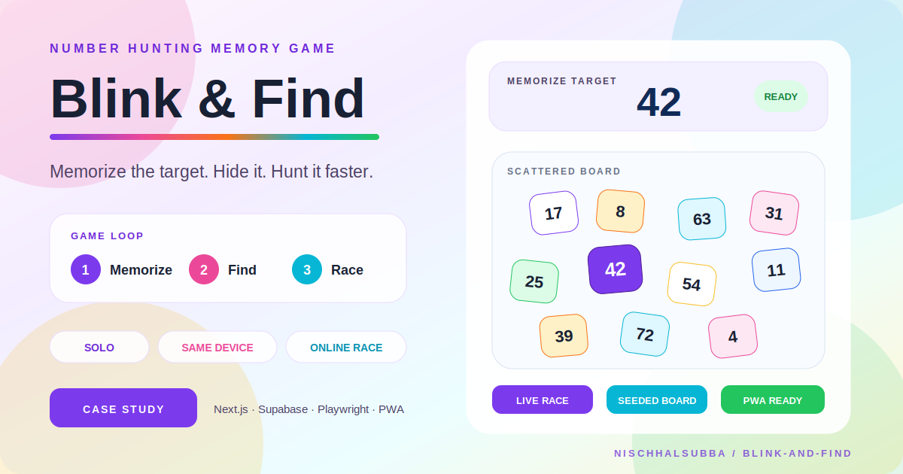

<div align="center">



# Blink & Find

### Memorize a number, hunt it across a scattered board, and race yourself or your friends

A free browser-based number-hunting memory game with solo play, same-device multiplayer, seeded online challenges, live races, daily modes, accessibility controls, persistent stats, and Supabase-backed room history.

[Play online](https://blink-and-find.hinischalsubba.workers.dev/) · [Engineering case study](./docs/PRODUCT_AND_ENGINEERING_CASE_STUDY.md) · [Repository instructions](./AGENTS.md)


</div>

## Product concept

Blink & Find turns a simple paper-style number hunt into a flexible browser game. A target number appears briefly, then hides. The player scans a scattered board, taps the match, and is scored by speed plus wrong-tap penalties.

The game supports both relaxed personal practice and competitive multiplayer without requiring an account for the core experience.

## Game modes

| Mode | Experience |
|---|---|
| Solo | Local timed rounds with saved settings and best scores |
| Same-device multiplayer | Players take turns on one device |
| Same Challenge | Friends receive the same seeded board and target in turn order |
| Live Race | Multiple players race simultaneously after a shared countdown |
| Daily Challenge | Shared daily board for comparable scores |
| Time Attack | Find as many targets as possible before time expires |
| Streak | Continue until one wrong tap ends the run |
| Practice | Play without score pressure |
| Comfort | Larger tiles, smaller boards, and gentler timing |
| Zen | Endless calm play without timer pressure |

Additional routes include tutorial, rules, tips, FAQ, profiles, statistics, leaderboard, online history, and shared challenge links.

## Core game loop

1. Configure board size, rounds, preview time, penalty, and optional required numbers.
2. Memorize the target during the preview phase.
3. Scan the scattered board after the target hides.
4. Tap the matching number.
5. Apply wrong-tap penalties when needed.
6. Save the turn result and advance the round or player.
7. Rank players by final accumulated time.

## Online play

### Same Challenge

Each player receives the same deterministic board and target for a round. Players complete turns in sequence, and room state advances through Supabase.

### Live Race

All players receive the same board, target, and `round_start_at` timestamp. The shared countdown is appropriate for casual friend competition, but it is not a cheat-resistant esports timing system. Humans do love turning every timer into an Olympic committee eventually.

### Recovery and history

The online layer includes:

- invite links and room codes
- QR-code sharing
- rejoin-last-room support
- active-turn recovery
- stale-room abandonment
- completed-room history
- round-level result storage
- player leaderboards

## Board generation

The engine supports:

- random boards
- custom required numbers
- deterministic seeded boards
- deterministic custom boards
- zig-zag ordering
- seeded zig-zag boards for multiplayer fairness

Online players derive the same layout from the same round seed instead of synchronizing every tile over the network.

## Architecture

```text
src/
├── app/                  routes, metadata, layouts, modes, rules, stats, history
├── components/           setup, ready, gameplay, summaries, results, shared UI
├── engine/               board and game-generation logic
├── hooks/                game controller and reusable browser behavior
├── lib/                  Supabase rooms, SEO, telemetry, validation, persistence
├── types/                local and online game contracts
└── utils/                deterministic and random shuffle helpers

supabase/
├── schema.sql
└── priority8_hardening.sql

tests/                    Playwright desktop and mobile smoke coverage
```

The root route is intentionally thin. It reads the game controller and chooses the correct screen for setup, ready, active play, round summary, or finished results.

## Data and trust model

Online rooms use four primary tables:

- `online_rooms`
- `online_players`
- `online_rounds`
- `online_results`

The project includes Realtime, Row Level Security policies for anonymous-room play, stale-room cleanup, and score-validation guardrails.

Anonymous multiplayer is convenient, but it should not be described as fully tamper-proof. Client-visible timing and identity always deserve suspicion, much like online polls and family WhatsApp statistics.

## Accessibility and mobile support

Implemented considerations include:

- keyboard navigation for number tiles
- visible focus styles
- ARIA live status updates
- text-based warning and status feedback
- reduced-motion support
- mobile-safe active gameplay layout
- comfort and practice modes
- responsive board-density rules
- safe-area-aware page spacing

## SEO and discoverability

The application includes:

- canonical production URL
- root and route-specific metadata
- Open Graph and Twitter cards
- structured data for WebSite, VideoGame, WebApplication, and HowTo
- sitemap and robots files
- PWA manifest and icon
- dedicated rules, tips, FAQ, and modes pages

Production URL:

```text
https://blink-and-find.hinischalsubba.workers.dev
```

## Run locally

Requirements:

- Node.js 20.9 or newer
- npm 10 or newer
- Supabase credentials for online features

```bash
npm install
cp .env.example .env.local
npm run dev
```

Environment variables:

```text
NEXT_PUBLIC_SUPABASE_URL=your-project-url
NEXT_PUBLIC_SUPABASE_PUBLISHABLE_KEY=your-publishable-key
```

Apply:

```text
supabase/schema.sql
supabase/priority8_hardening.sql
```

## Verification

```bash
npm run check
npm run e2e
npm run audit:prod
```

`npm run verify` runs the main quality checks and browser tests.

CI currently performs:

- lint
- TypeScript validation
- production build
- Playwright smoke tests
- production dependency audit

Playwright targets desktop Chromium and a Pixel 7 mobile profile.

## Current status

| Area | Status |
|---|---|
| Local solo play | Implemented |
| Same-device multiplayer | Implemented |
| Same Challenge | Implemented |
| Live Race | Implemented |
| Daily, Time Attack, Streak, Practice, Comfort, and Zen modes | Implemented |
| Supabase room history and leaderboard | Implemented |
| Deterministic online boards | Implemented |
| Desktop and mobile Playwright projects | Configured |
| CI quality workflow | Implemented |
| Production deployment | Documented in source metadata |
| Fresh browser screenshot in this documentation pass | Not captured |

The current execution environment could not resolve the deployed domain or GitHub through ordinary DNS, so no fresh runtime screenshot was fabricated. The repository thumbnail is a designed presentation asset based on the real game interface.

## Known risks

- Anonymous rooms are not equivalent to strong authenticated sessions.
- Live Race timing is casual and latency-tolerant rather than cheat-resistant.
- Client-visible scores still require server-side validation discipline.
- Supabase policies must stay aligned with schema changes.
- Multiplayer recovery logic is more complex than local game flow.
- Social-preview metadata references should be verified during deployment.
- Dependency updates can affect Cloudflare and Next.js compatibility.

## Recommended next work

1. Add stronger server-authoritative validation for competitive results.
2. Add authenticated profiles only if the product truly needs them.
3. Expand unit coverage for board generation and score validation.
4. Add visual regression screenshots for core routes.
5. Verify the deployed social-preview asset.
6. Capture real desktop and mobile production screenshots.
7. Add performance budgets for large custom boards.

## Documentation

- [Product and engineering case study](./docs/PRODUCT_AND_ENGINEERING_CASE_STUDY.md)
- [Repository instructions](./AGENTS.md)
- [Branded repository thumbnail](./docs/assets/blink-and-find-thumbnail.svg)
- [SEO notes](./docs/SEO.md)

## Author

Designed and developed by [Nischhal Subba](https://nischhalsubba.com.np/).
