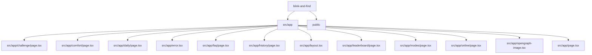
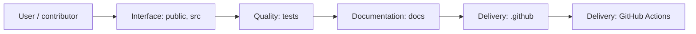
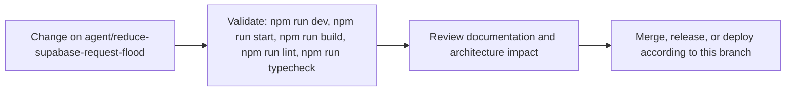

# Blink & Find

<!-- interactive-readme-standard:start -->

> [!NOTE]
> **Branch-specific documentation:** this section is maintained for [`agent/reduce-supabase-request-flood`](https://github.com/Nischhalsubba/blink-and-find/tree/agent/reduce-supabase-request-flood). It is generated from the files present on this branch and preserves the project-authored README below.

<details open>
<summary><strong>Interactive repository guide</strong></summary>

## Branch overview

| Item | Value |
|---|---|
| Repository | [`Nischhalsubba/blink-and-find`](https://github.com/Nischhalsubba/blink-and-find) |
| Branch | [`agent/reduce-supabase-request-flood`](https://github.com/Nischhalsubba/blink-and-find/tree/agent/reduce-supabase-request-flood) |
| Detected stack | Next.js, React, Tailwind CSS, TypeScript, CSS, JavaScript, HTML |
| Detected manifests | package.json |
| Documentation policy | Every maintained branch must explain purpose, setup, structure, architecture, flows, testing, delivery, security, and ownership. |

## Repository structure


```mermaid
flowchart TD
    ROOT["blink-and-find / agent/reduce-supabase-request-flood"]
    ROOT --> P0[".github/"]
    ROOT --> P1["docs/"]
    ROOT --> P2["public/"]
    ROOT --> P3["src/"]
    ROOT --> P4["supabase/"]
    ROOT --> P5["tests/"]
    ROOT --> P6[".env.example"]
    ROOT --> P7[".node-version"]
    ROOT --> P8[".npmrc"]
    ROOT --> P9[".nvmrc"]
    ROOT --> P10["components.json"]
    ROOT --> P11["DEPLOYMENT.md"]
    ROOT --> P12["eslint.config.mjs"]
    ROOT --> P13["next-env.d.ts"]
    ROOT --> P14["next.config.ts"]
    ROOT --> P15["package.json"]
    ROOT --> P16["playwright.config.ts"]
    ROOT --> P17["postcss.config.mjs"]
    ROOT --> MORE["+ 1 more top-level entries"]
```

The diagram is generated from the branch's actual top-level files and directories. Use the branch link above for complete source navigation.

## Website or application structure


```mermaid
flowchart TD
    APP["blink-and-find"]
    APP --> R0["src/app"]
    APP --> R1["public"]
    R0 --> F0["src/app/challenge/page.tsx"]
    R0 --> F1["src/app/comfort/page.tsx"]
    R0 --> F2["src/app/daily/page.tsx"]
    R0 --> F3["src/app/error.tsx"]
    R0 --> F4["src/app/faq/page.tsx"]
    R0 --> F5["src/app/history/page.tsx"]
    R0 --> F6["src/app/layout.tsx"]
    R0 --> F7["src/app/leaderboard/page.tsx"]
    R0 --> F8["src/app/modes/page.tsx"]
    R0 --> F9["src/app/online/page.tsx"]
    R0 --> F10["src/app/opengraph-image.tsx"]
    R0 --> F11["src/app/page.tsx"]
```

## Application and responsibility flow


```mermaid
flowchart LR
    ACTOR["User / contributor"]
    ACTOR --> A0["Interface: public, src"]
    A0 --> A1["Quality: tests"]
    A1 --> A2["Documentation: docs"]
    A2 --> A3["Delivery: .github"]
    A3 --> DELIVERY["Delivery: GitHub Actions"]
```

## Change-to-delivery flow


```mermaid
flowchart LR
    CHANGE["Change on agent/reduce-supabase-request-flood"]
    CHECK["Validate: npm run dev, npm run start, npm run build, npm run lint, npm run typecheck"]
    REVIEW["Review documentation and architecture impact"]
    RELEASE["Merge, release, or deploy according to this branch"]
    CHANGE --> CHECK --> REVIEW --> RELEASE
```

## README requirements for this branch

- Explain what this branch contains and how it differs from the default branch.
- Keep installation, configuration, usage, testing, deployment, security, support, and license information accurate.
- Document repository, website or application, API, data, authentication, background-job, and deployment flows when they exist.
- Prefer Mermaid diagrams and expandable `<details>` sections for visual navigation.
- Link diagrams and modules to real source paths; never invent missing components.
- Preserve project-specific documentation and update diagrams whenever architecture or major paths change.
- Treat secrets, private infrastructure, customer data, and credentials as prohibited README content.

</details>

<!-- interactive-readme-standard:end -->

Memorize. Hide. Hunt the scattered number.

Blink & Find is a free online number hunting memory game where players memorize a target number, find it inside a scattered board, and race friends in Same Challenge or Live Race mode.

## Current Features

- One-tap **Play Now** local game
- Friendly new-player microcopy across setup, ready, gameplay, summary, and results screens
- Dedicated `/rules` page explaining how the game works
- SEO metadata, sitemap, robots file, and structured data
- **Play with Friend** online entry with Create / Join pill choices
- Single-player and same-device multiplayer modes
- Online Same Challenge rooms with Supabase sync
- Online Live Race rooms with shared countdown
- Same-board simultaneous play for Live Race
- Live Race result placement after every player finishes
- Online invite links with auto-join support
- Native share invite flow where supported
- QR code invite for room joining
- Copy-link fallback for invite sharing
- Rejoin-last-room support after refresh
- Active-turn recovery after refresh
- Stale online room cleanup
- Central online history screen
- Recent finished games
- Online player leaderboard
- Room detail with round-by-round results
- Database guardrails for anonymous online play
- CI workflow for lint, typecheck, build, and audit
- Mobile-safe active gameplay layout
- Central room/player/round/result tables through Supabase
- Same Challenge and Live Race room types
- Dynamic player count for custom local games
- Dynamic round count
- Easy, normal, and hard board sizes
- Scattered handwritten-style number layout
- Per-round board reshuffle/repositioning
- Fair seeded board generation for online play
- Pre-turn ready screen
- Target preview countdown
- Timer-based scoring
- Wrong-tap penalties
- Round summaries
- Final rankings and round history
- Saved local settings and best scores via local storage
- Online result saving via Supabase
- Copyable local result summary
- Sound effects with mute toggle
- Mobile vibration feedback
- Optional auto-continue after correct taps
- Keyboard navigation for number tiles
- ARIA live status updates
- Reduced-motion support
- PWA manifest and app icon
- shadcn/ui component system with Tailwind CSS

## How to Play

Open `/rules` for the player-facing guide.

Quick rules:

1. Memorize the target number during preview.
2. Find the matching number after it hides.
3. Wrong taps add penalty seconds.
4. Lowest total time wins.
5. Same Challenge gives each friend the same target and board in turn order.
6. Live Race lets friends race at the same time after a shared countdown.

## Online Play

### Same Challenge

Same Challenge is playable now.

Flow:

1. Player A opens the app.
2. Player A taps **Play with Friend**.
3. Player A chooses **Create** and taps **Create Game**.
4. Player A shares the invite link, shows the QR code, or gives Player B the room code.
5. Player B opens the invite link, scans the QR code, or joins with the room code.
6. Player A starts the game.
7. Each player takes a turn on their own device.
8. Every player gets the same board and target for that round.
9. Each new round reshuffles and repositions the board.
10. Results are saved centrally in Supabase.

If a player refreshes, the app saves the last room locally and can restore the room automatically or through **Rejoin Last Room**. If the active player refreshes mid-turn, the app offers **Restart Turn** on the same board and target instead of leaving the room stuck. Tiny mercy, since browsers do enjoy forgetting things at the worst possible time.

Unfinished stale rooms are marked `abandoned` automatically. Lobbies expire after 2 idle hours; active rooms expire after 6 idle hours. Finished rooms stay available on the central history screen.

### Live Race

Live Race is playable now.

Flow:

1. Player A taps **Play with Friend**.
2. Player A opens **Name and options**.
3. Player A selects **Live Race**.
4. Player A creates the room and invites Player B.
5. Player A starts the game after Player B joins.
6. Both players see the same countdown, same target, and same board.
7. When the countdown reaches zero, the target hides and both players race at the same time.
8. Correct taps submit results to Supabase.
9. The round closes when every player has submitted.
10. Results are ranked by final time.

Live Race uses a shared `round_start_at` timestamp for casual latency-tolerant timing. It is fair enough for friends, not yet armored against determined cheating. Stronger server/auth security can come after the no-login MVP.

### History

Open `/history` or tap **History** on the setup screen to see finished online rooms, winners, player leaderboard, and round-by-round room details.

## SEO

Implemented SEO basics:

- root metadata title and description
- Open Graph and Twitter cards
- JSON-LD for WebSite, VideoGame, WebApplication, and HowTo
- `/sitemap.xml`
- `/robots.txt`
- player-friendly `/rules` page
- PWA manifest description

See `docs/SEO.md` for the indexing and Google Search Console checklist. Search ranking is not guaranteed, because Google is a search engine, not a vending machine with vibes taped to it.

## Stack

- Next.js
- React
- TypeScript
- Tailwind CSS
- shadcn/ui-style components
- Radix UI primitives
- Supabase
- Cloudflare Pages

## Development

```bash
npm install
npm run dev
```

Open the local URL shown in your terminal.

## Supabase Setup

Create `.env.local` from `.env.example`:

```bash
cp .env.example .env.local
```

Add your Supabase project values:

```bash
NEXT_PUBLIC_SUPABASE_URL=your-project-url
NEXT_PUBLIC_SUPABASE_PUBLISHABLE_KEY=your-publishable-key
```

Then open Supabase SQL Editor and run the contents of:

```bash
supabase/schema.sql
```

After that, run the production hardening migration:

```bash
supabase/priority8_hardening.sql
```

The SQL creates:

- `online_rooms`
- `online_players`
- `online_rounds`
- `online_results`

It also enables Realtime, Row Level Security policies for the MVP anonymous-room flow, the `abandon_stale_online_rooms` cleanup helper, and database guardrails for room/result integrity.

## Quality Checks

```bash
npm run check
npm run audit:prod
```

Generate the npm lockfile locally once:

```bash
npm install --package-lock-only
```

Then commit `package-lock.json` so future CI can switch to `npm ci`.

## Deployment Notes

This project is hosted on Cloudflare Pages.

Recommended Cloudflare Pages settings:

- Framework preset: Next.js
- Install command: `npm install`
- Build command: `npm run build`
- Output directory: use the default Cloudflare Pages output for the selected Next.js preset

Add these Cloudflare Pages environment variables:

- `NEXT_PUBLIC_SUPABASE_URL`
- `NEXT_PUBLIC_SUPABASE_PUBLISHABLE_KEY`

If a deployment fails after dependency changes, retry the deployment after Cloudflare has installed the latest dependency graph. The machines are dramatic, but they do eventually read `package.json`.

## Product Notes

The board intentionally avoids strict rows and columns. For online play, board generation is deterministic per round, so players in the same room receive the same scattered layout. The next round uses a new seed, so the positions change without ruining multiplayer fairness. Chaos, but with paperwork.
