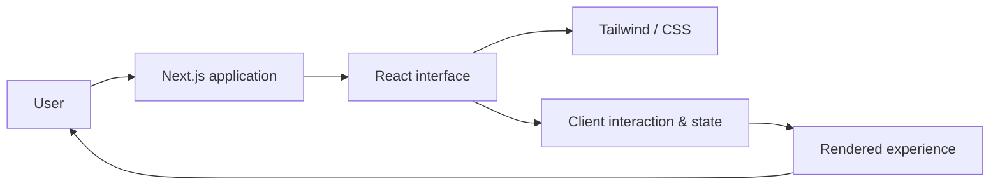
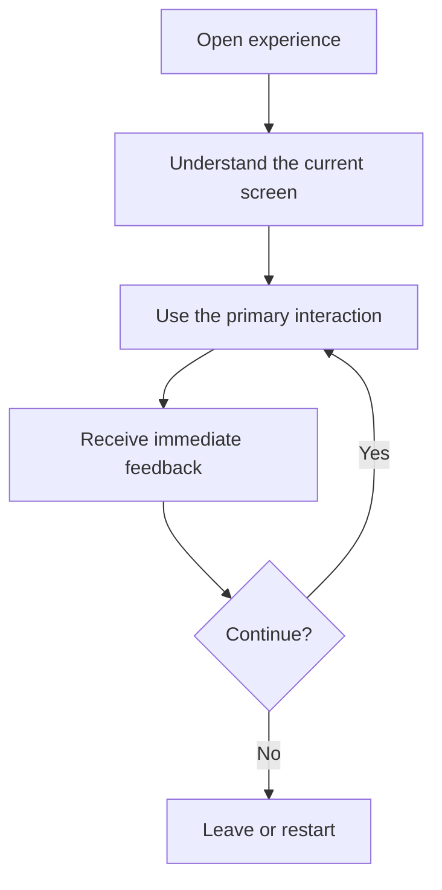
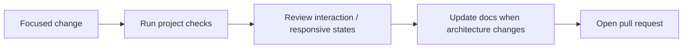

<div align="center">

# Blink and Find

**A modern web interface project built with Next.js, React, TypeScript, and Tailwind CSS, documented for developers, designers, reviewers, and future maintainers.**


[Browse app](./web) · [Technical README](./web/README.md) · [Issues](https://github.com/Nischhalsubba/blink-and-find/issues)

</div>

## Overview

The maintained application lives under `web/`. This root README explains the product shape without requiring a reader to understand the framework first. Detailed branch-aware implementation notes remain in [`web/README.md`](./web/README.md).

| Audience | Start here |
|---|---|
| Developers | Architecture, application folder, setup and quality checks |
| Designers | Experience flow, responsive behavior, states and accessibility |
| Product / content | User journey, information hierarchy and public-facing copy |
| Reviewers | Repository map and contribution flow |

<details open>
<summary><strong>🏗️ Interactive application architecture</strong></summary>


```mermaid
flowchart LR
    USER["User"] --> NEXT["Next.js application"]
    NEXT --> UI["React interface"]
    UI --> STYLE["Tailwind / CSS"]
    UI --> STATE["Client interaction & state"]
    STATE --> RESULT["Rendered experience"]
    RESULT --> USER
```

</details>

## Experience flow


```mermaid
flowchart TD
    START["Open experience"] --> ORIENT["Understand the current screen"]
    ORIENT --> INTERACT["Use the primary interaction"]
    INTERACT --> FEEDBACK["Receive immediate feedback"]
    FEEDBACK --> NEXT{"Continue?"}
    NEXT -->|Yes| INTERACT
    NEXT -->|No| END["Leave or restart"]
```

## Repository map

```text
blink-and-find/
├── .github/   # repository automation
├── web/       # maintained Next.js application
└── README.md  # project overview
```

## Getting started

```bash
git clone https://github.com/Nischhalsubba/blink-and-find.git
cd blink-and-find/web
```

Use the package manager indicated by the committed lockfile, then run the scripts declared in `package.json`. Refer to [`web/README.md`](./web/README.md) for current project-specific commands.

## Design quality

Keep interaction states obvious, motion purposeful, keyboard focus visible, touch targets usable, content readable at narrow widths, and feedback immediate enough that the user never has to guess whether an action worked.

## SEO & discoverability

Use a descriptive product title and summary in public metadata, semantic page headings, meaningful link text, accessible media alternatives, canonical URLs, and Open Graph/social metadata. Repository documentation should naturally explain the product, its web stack, and its interaction model so both people and search systems can understand what it contains.

## Contribution flow


```mermaid
flowchart LR
    CHANGE["Focused change"] --> CHECK["Run project checks"]
    CHECK --> UX["Review interaction / responsive states"]
    UX --> DOCS["Update docs when architecture changes"]
    DOCS --> PR["Open pull request"]
```
